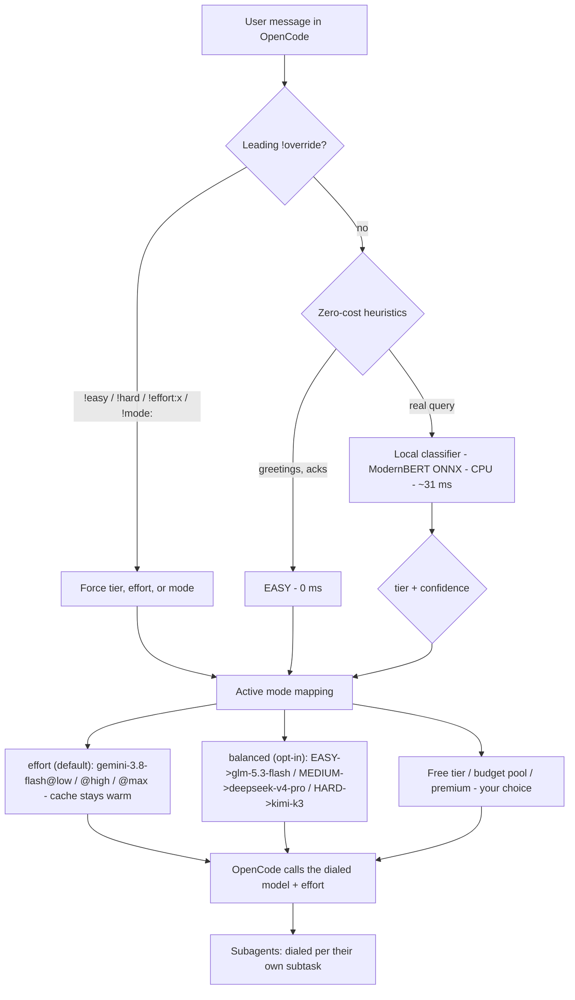

<div align="center">

> ## 🛑 STATUS: PAUSED — do not rely on this yet
>
> Development is paused while we reassess the approach. Honest concerns with
> the current design:
>
> 1. **Per-message complexity classification is a weak proxy.** A short
>    message riding on a huge, complex context — *"fix it"* after 200k tokens
>    of debugging — is classified by the text alone, so it lands on a
>    low-effort tier and the model fumbles. The classifier doesn't see the
>    context it's about to work on.
> 2. **Heuristic complexity scoring is near-random.** LiteLLM's own benchmark
>    measured a rule-based complexity scorer at **AUC ≈ 0.52** — barely better
>    than a coin flip. Our classifier (ModernBERT fine-tune) is better than
>    that, but the signal quality of "complexity from a single prompt" is a
>    known open problem.
> 3. **The lightweight model trap is real.** Our own measured accuracy:
>    fp32 ModernBERT 66.7% / int8 ModernBERT 43.3% / heuristic 0%. The int8
>    export is *worse than shipping no model* — it collapses the MEDIUM tier
>    and misdials HARD queries to EASY. There is no free lunch to a lighter
>    model without retraining.
> 4. **Errors don't mean "hard."** A flaky test or a missing dependency isn't
>    task complexity — a failure is evidence the *current attempt* isn't
>    resolving, not that the task itself is complex. Treating failures as
>    complexity inflates tiers on trivial-but-failing work.
> 5. **The root cause may be harness misuse, not routing.** Long-running
>    single threads cause context bloat, quality degradation, and lossy
>    compaction. The industry answer to that is short focused threads +
>    subagents, not a better model selector. Until we validate session hygiene
>    as the fix, a router is polishing the wrong layer.

# prompt-demux

**Dial the right amount of effort for every prompt.**

A local, CPU-only classifier that reads each prompt's complexity, then
**dials the response budget** for it — trivial chats get low effort / a cheap
model, hard problems get maximum effort / a stronger model. ~31 ms, no GPU,
no cloud in the decision.

**Two knobs, one dial face.** A "route" is `provider/model[@variant]`:
- *model* — which model handles the request (`opencode/…`, `openrouter/…`, local `ollama/…`)
- *`@variant`* — how much reasoning **effort** that model applies (`@low` / `@high` / `@max`, or the provider's own preset)

You can hop models, hop effort, or both. Defaults in the repo are the
author's personal picks — not a prescription. `prompt-demux.json` is **your**
file to shape.

**Works entirely within OpenCode by default** — the built-in `opencode/`
provider (free [OpenCode Zen](https://opencode.ai/zen) account), no
third-party gateway. OpenRouter keys? One-line swap (see
[Configuration](#configuration)).

[](https://github.com/ajaleelp/prompt-demux/actions)
[](https://www.python.org)
[](https://nodejs.org)
[](#license)

</div>

---

## Why this exists

Every prompt in a coding session doesn't deserve the same response budget.
"thanks!" and "design a distributed consensus protocol" shouldn't cost the
same in effort (or money). Two failure modes:

1. **Premium-everything**: maximum reasoning applied to trivial queries — slow, credits drain
2. **Cheap-everything**: a light model fumbles the hard task — time wasted redoing it

prompt-demux solves both: read each prompt's complexity, dialing the right
effort (and the right model) per message — spend heavily only where it
matters.

> **The defaults in this repo are what I prefer — not what you should use.** The
> dial just maps three complexity tiers to whatever effort/models *you* want.
> Pick models you have access to, tune effort to taste, use different providers
> per tier, use local models — it's all config.

### Why not just let a gateway auto-route (e.g. OpenRouter's `auto`)?

[`openrouter/auto`](https://openrouter.ai/openrouter/auto) is genuinely good.
This project exists because "genuinely good" wasn't the same as what I needed:

| | gateway `auto` (e.g. `openrouter/auto`) | prompt-demux |
|---|---|---|
| **What runs my prompt** | Opaque model picks from their catalog | You pin exact model *and effort level* per tier |
| **Effort control** | Server-side, opaque | Local, exact — `@variant` reasoning effort per tier, or per message |
| **Wallet topology** | One wallet — when it's empty, everything stops | **Multi-wallet runway**: map tiers to different providers/accounts — free tiers for EASY, a separate cheap pool for MEDIUM, premium credits only for HARD |
| **Top-up economics** | ~5% credit purchase fee on all usage | Most traffic can flow through direct/free channels |
| **Routing logic** | Server-side, not inspectable | Local ONNX model + your config, fully auditable |
| **Latency** | adds server-side round trip | ~31 ms on CPU, fully offline |
| **Override / steering** | fallback model list | `!easy` `!hard` `!effort:low` `!mode:` prefixes, session-sticky modes |
| **Setup** | one line | plugin + ~750 MB local model |

The killer feature is **credit runway**: when EASY goes to a free tier and
MEDIUM to a budget model, your premium credits become a *reserve for work
that actually needs them* — instead of the whole system dying when one
wallet hits zero. And because it's your mapping, "cheap" and "premium" are
whatever you define: different providers, different accounts, free tiers,
local models, whatever.

**When auto is the better choice:** if you already pay OpenRouter, don't
want to run anything local, and trust their router's judgment — use it.
This project trades convenience for control.

## Similar work (and how this differs)

The routing space is crowded — but the *combination* this plugin occupies is
not. Here's the honest landscape (Sept 2026):

| Project | What it is | How `prompt-demux` differs |
|---|---|---|
| [claude-code-router](https://github.com/musistudio/claude-code-router) (~37k★) | Local **proxy gateway** switching **models** across providers/agents | A proxy, not a plugin — can't touch OpenCode's per-message `model.variant` state; switches models (cache-expensive), not effort |
| [weave-os/router](https://github.com/weave-os/router) (~3.9k★) | Go proxy, per-action **model** route using a tiny embedder | Proxy again; effort-only in-process routing (which never breaks the cache) is its blind spot |
| [opencode-model-router](https://github.com/marco-jardim/opencode-model-router) (102★) | OpenCode plugin, but **LLM prompt delegation** — an orchestrator re-delegates via subagents | No ML classifier, no local model; costs an LLM round-trip per message; not cache-friendly by design |
| [opencode-reasoning-effort](https://github.com/Aliancn/opencode-reasoning-effort) | Narrows to one thing: patch `fetch` so `reasoning_effort` reaches the wire | Single-purpose patch; no complexity tiering, no fallback, no config |
| OpenRouter `auto` / `pareto-code` | Server-side opaque model routing | Not local, not auditable, no per-message effort dial, runs outside OpenCode |

The combination that's unoccupied: **in-process OpenCode plugin + local ML
classifier + effort-first dialing (same model, `@low/@high/@max`) + cache
stickiness** — so the prompt cache never breaks. A proxy can't see
OpenCode's per-message effort state; an LLM-delegation plugin spends more and
can't guarantee cache warmth. That's the square this project sits in.

## What it does



Every decision is logged (`dialed HARD -> .../kimi-k3@max source=classifier
confidence=0.99`) and cached — repeated queries cost 0 ms.

## Verified behavior (live E2E on OpenCode 1.18.x, with the author's default routes)

| Scenario | Result |
|---|---|
| "thanks" | heuristic → EASY → gemini-3.8-flash@low (0 ms) |
| "Explain closures in JavaScript" | classifier → MEDIUM → gemini-3.8-flash@high |
| "Implement a distributed consensus algorithm" | classifier → HARD → gemini-3.8-flash@max |
| `!hard ...` prefix | override → HARD target, prefix stripped from model-visible text |
| `!mode:balanced ...` | switch to model-hopping mode, sticks for the session |
| effort mode (`@low/@high/@max`) | same model, reasoning-effort variant merged into the request (verified live) |
| Task-tool subagent | dialed **per its own task complexity** (child sessions flow through the same hook) |
| plugin off (`--pure`) | nominal model used (control test) |

## The cost math

Using the default `effort` mode on the `opencode/` provider (Zen pricing,
per answer) — one model, reasoning effort dialed per tier. Swap in your own
models/efforts and the numbers change, but the *shape* stays:

| Query | Dialed target | Cost | Un-dialed (max effort, every query) | Savings |
|---|---|---|---|---|
| "Reply with exactly: OK" (EASY) | gemini-3.8-flash@low | ~$0.00002 | ~$0.02 | **~99%** |
| "Explain closures..." (MEDIUM) | gemini-3.8-flash@high | ~$0.002 | ~$0.02 | ~90% |
| "Implement distributed consensus" (HARD) | gemini-3.8-flash@max | premium | premium | by design |

Illustrative session mix (70% EASY / 20% MEDIUM / 10% HARD, ~150-token
prompts): dialing EASY to `@low` and HARD to `@max` on one warm model yields
roughly **3–6× fewer reasoning tokens spent** vs max-effort on everything —
and because the model never changes, the prompt cache stays warm turn after
turn. Your mix will differ; the point is the *shape*: most chat is EASY, and
EASY shouldn't burn reasoning tokens or cold cache.

Add free tiers (an `…:free` variant or the `opencode/…-free` models) as your
EASY target and the floor drops to $0.00.

## Quickstart

### Option A — from npm (recommended)

```bash
opencode plug opencode-effort-demux --global
```

This installs the plugin globally (auto-fetched by Bun into OpenCode's plugin
cache). Then configure your dial in `~/.config/opencode/prompt-demux.json`.

### Option B — clone & run

```bash
git clone https://github.com/ajaleelp/prompt-demux
cd prompt-demux
./scripts/setup.sh          # add -y to skip the confirmation prompt
```

### Prerequisites

- **Python 3.9+** (the classifier runs 100% locally on CPU)
- **Node 22+** (for the plugin SDK)
- An **OpenCode** install. A free
  [OpenCode Zen](https://opencode.ai/zen) sign-in unlocks `opencode/…`
  models (the default); the `free-optimal` mode's free models need no billing
  beyond the Zen sign-in. If you prefer OpenRouter, any existing key works
  with `openrouter/…` refs instead. No Hugging Face account is required —
  the classifier model is served from a public repo.

### One-command setup (recommended)

```bash
git clone https://github.com/ajaleelp/prompt-demux
cd prompt-demux
./scripts/setup.sh          # add -y to skip the confirmation prompt
```

**What it does in the background, before you confirm it:**

1. Creates a Python venv and installs the classifier deps
   (`onnxruntime`, `fastapi`, `uvicorn`, …).
2. **Downloads the classifier model from Hugging Face** (~750 MB fp32 +
   int8 variants, SHA-verified) into `classifier-service/model/`.
3. Runs `npm install` in `opencode-plugin/` (pulls `@opencode-ai/plugin`).
4. Installs the **global** plugin shim + default config at
   `~/.config/opencode/` so routing works in every project.
5. Starts the classifier server on `http://127.0.0.1:8010` (nohup, log at
   `/tmp/prompt-demux-classifier.log`).

That's the whole setup. Restart OpenCode (full quit), pick **Prompt Demux Auto**
from the dropdown, and prompts get dialed automatically. Verify from the CLI:

```bash
opencode run -m prompt-demux/auto "thanks" --print-logs | grep -E "dialed|routed"
# ... dialed EASY -> opencode/glm-5.3-flash source=heuristic
```

### What each piece does (manual, if you prefer the pieces separately)

Prefer to run the classifier service yourself (screen/tmux/launchd)? Then:

```bash
cd classifier-service
python3 -m venv venv
venv/bin/pip install -r requirements.txt
venv/bin/python download_model.py     # ~750 MB, SHA-verified -> ./model/
venv/bin/python server.py             # serves 127.0.0.1:8010
```

Test it:

```bash
curl -s -X POST http://127.0.0.1:8010/classify \
  -H 'Content-Type: application/json' \
  -d '{"query":"Explain closures in JavaScript"}'
# {"tier":"MEDIUM", "confidence":0.84, "latency_ms":29.7, ...}
```

And the plugin separately:

```bash
cd opencode-plugin && npm install && cd ..
opencode run --print-logs "thanks"     # in-repo .opencode/plugins/ loads
```

The in-repo shim (`.opencode/plugins/prompt-demux.ts`) imports via a
relative path, so a fresh clone works as-is — no absolute paths to edit.
For routing in *every* project, `./scripts/setup.sh` already did the
[global install](#optional-global-install) for you.

### OpenCode Zen (needed for the default `opencode/…` modes)

The default modes all use the built-in `opencode/` provider — no third-party
gateway. Signing in once (free) unlocks every model, and the free models in
`free-optimal` need no billing on top of that:

1. Run `/connect` in the OpenCode TUI and pick **OpenCode Zen**.
2. A browser tab opens — sign in and copy your API key.
3. Paste it back, then verify with `opencode models | grep opencode/`.

Prefer another provider like OpenRouter? Just swap the `provider/` prefix as
described in [Configuration](#openrouter-just-my-defaults-are-openrouter-make-it-work-either-way).

### Optional: global install

To use routing in **every** project (not just this repo), install the shim
into OpenCode's global plugin directory:

```bash
./scripts/install-global.sh
```

This copies a shim to `~/.config/opencode/plugins/prompt-demux.ts` pointing
at your local clone, and drops a default `prompt-demux.json` at
`~/.config/opencode/prompt-demux.json` if you don't already have one. Your
project-level `prompt-demux.json` (if present) still takes precedence.

## Configuration

**This is the whole point.** `prompt-demux.json` is read on every message (no
restart) and maps the three complexity tiers to whatever effort/models *you*
want. The default mode — `effort` — keeps things cache-friendly; the model-
hopping modes are opt-in. Rip it apart and make it yours.

The default config (one model, effort dialed per tier — the cache-friendly
default):

```jsonc
{
  "activeMode": "effort",
  "modes": {
    "effort": {
      "description": "One model, effort dialed per tier - keeps the prompt cache warm",
      "EASY":   "opencode/gemini-3.8-flash@low",    // low reasoning effort
      "MEDIUM": "opencode/gemini-3.8-flash@high",   // push harder
      "HARD":   "opencode/gemini-3.8-flash@max"     // go all in
    }
  },
  "classifier": { "url": "http://127.0.0.1:8010/classify", "timeoutMs": 2000 }
}
```

**All default refs are `opencode/…`** — the built-in provider, no third-party
gateway. You only need a free [OpenCode Zen](https://opencode.ai/zen) account
(via `/connect` → OpenCode Zen).

**Why effort-first?** Switching reasoning effort on the *same model* preserves
the provider's prompt cache (cache is keyed per model), so you pay for
reasoning tokens, not cold cache misses. Switching *models* invalidates the
cache — powerful, but expensive in warm sessions. So model hopping lives
behind a deliberate choice.

### Model hopping is opt-in

Prefer a different model per tier? Same dial, different knob — just swap the
`provider/model` string. Use it when you care more about capability-spread
across vendors than cache warmth:

```jsonc
{
  "activeMode": "balanced",
  "modes": {
    "balanced": {
      "description": "Cross-provider value picks",
      "EASY":   "opencode/glm-5.3-flash",
      "MEDIUM": "opencode/deepseek-v4-pro",
      "HARD":   "opencode/kimi-k3"
    },
    "frontier-value": {
      "description": "Higher quality per tier",
      "EASY":   "opencode/glm-5.3-flash",
      "MEDIUM": "opencode/gemini-3.8-flash",
      "HARD":   "opencode/claude-fable-5-1"
    }
  }
}
```

Both hops can coexist — mix `provider/model` and `provider/model@variant`
refs freely across modes.

### OpenRouter? Just my defaults are OpenRouter... make it work either way

The choice to use `openrouter/…` refs is purely yours — the router doesn't
care what provider the refs point at. To run through OpenRouter instead:

1. Sign in with OpenRouter (`/connect` → OpenRouter, paste your key).
2. Swap the `provider/` prefix only — the easy part `"opencode/glm-5.3-flash"`
   becomes `"openrouter/z-ai/glm-5.3-flash"`, etc. OpenRouter slugs carry the
   model family after the first segment, e.g. `openrouter/deepseek/deepseek-v4-pro-0813`.

The full OpenRouter variant of the default config:

```jsonc
{
  "activeMode": "effort",
  "modes": {
    "effort": {
      "description": "One model, effort dialed per tier, via OpenRouter",
      "EASY":   "openrouter/z-ai/glm-5.3-flash@low",
      "MEDIUM": "openrouter/z-ai/glm-5.3-flash@high",
      "HARD":   "openrouter/z-ai/glm-5.3-flash@max"
    },
    "balanced": {
      "description": "Cross-provider value picks, via OpenRouter",
      "EASY":   "openrouter/z-ai/glm-5.3-flash",
      "MEDIUM": "openrouter/deepseek/deepseek-v4-pro-0813",
      "HARD":   "openrouter/moonshotai/kimi-k3"
    }
  }
}
```

Model refs are `provider/model` (split on the **first** slash, so OpenRouter
slugs like `openrouter/anthropic/claude-fable-5.1` work as-is).

### Effort hopping (`provider/model@variant`) — how it works

Effort is the first-class dial: a tier maps to *the same model at different
reasoning efforts*, instead of switching models. End a ref with `@variant`
and OpenCode merges that model's named variant (reasoning effort / thinking
budget) into the request for that message:

```json
"effort": {
  "description": "One model, effort dialed per tier",
  "EASY":   "opencode/gemini-3.8-flash@low",
  "MEDIUM": "opencode/gemini-3.8-flash@high",
  "HARD":   "opencode/gemini-3.8-flash@max"
}
```

Variants come from OpenCode's built-in defaults (e.g. Anthropic `high`/`max`,
OpenAI `none`/…/`xhigh`, Google `low`/`high`), or you can define your own per
model in `opencode.json`:

```json
{ "provider": { "opencode": { "models": { "gemini-3.8-flash": {
  "variants": { "low": { "thinkingLevel": "low" }, "high": { "thinkingLevel": "high" } }
} } } } }
```

A plain `provider/model` ref works too (default effort) — the `@variant`
suffix is optional. Verified end-to-end: the chosen variant's options are
merged into both the main and auxiliary (title) requests.

### Configuring your routes (the part that's *yours*)

The config is a plain JSON file — no code involved. A mode is just three
lines:

```json
"my-mode": {
  "EASY":   "opencode/glm-5.3-flash",       // cheap + low effort
  "MEDIUM": "opencode/gemini-3.8-flash@high",
  "HARD":   "opencode/claude-fable-5-1@max" // max effort on the best model
}
```

Rules of thumb:

- **Swap the ref** to change what a tier uses — that's the whole feature.
  Find exact IDs with `opencode models` and paste any model you have access
  to: `opencode/…`, `openrouter/…`, or a local `ollama/…`. Add `@variant`
  to set effort.
- **`activeMode`** picks which mode is used by default. Switch it to
  `"frontier-value"` for higher quality (pricier), or `"free-optimal"` for
  $0 across the board — or set your own.
- **Add a new mode** by copying a block and renaming it; it automatically
  appears in the Prompt Demux dropdown (e.g. `prompt-demux/my-mode`).
- **The config reloads every message** — no restart needed to test a change.
- Keep it valid JSON: no trailing commas, all keys quoted. A parser will
  fail silently to the fallback; run `jq . prompt-demux.json` to check.

Need a free option? The `free-optimal` mode uses `opencode/…` Zen models
(details above). You can also point EASY at an `…:free` variant on whatever
provider you use.

### Overrides (message prefix, stripped before the model sees them)

| Prefix | Effect |
|---|---|
| `!easy` / `!free` | force EASY tier for this message |
| `!medium` | force MEDIUM tier |
| `!hard` / `!premium` | force HARD tier |
| `!mode:<name>` | switch mode; **sticks for the session** |

### The `router` tool

The plugin registers a `router` tool — in chat, just ask:

- *"what routing modes are there?"* → `list`
- *"switch the default to frontier-value"* → `set`
- *"add a mode called reason with o3 for hard"* → `add`

## Architecture

```
prompt-demux/
├── classifier-service/        # Python side
│   ├── classifier.py          # QueryComplexityClassifier (ONNX CPU)
│   ├── server.py              # FastAPI /classify on 127.0.0.1:8010
│   ├── download_model.py      # fetches ONNX weights (SHA-verified)
│   └── model/                 # downloaded weights (git-ignored)
├── opencode-plugin/           # TypeScript side
│   ├── src/lib.ts             # pure helpers (parsing, config, heuristics)
│   ├── src/main.ts            # chat.message hook (dial model+effort) + router tool
│   └── tests/                 # unit tests (node:test) + smoke test
├── scripts/
│   ├── setup.sh               # one-command install (venv, model, shim, server)
│   └── install-global.sh      # global plugin shim + default config
├── .opencode/plugins/prompt-demux.ts   # shim OpenCode auto-loads
└── prompt-demux.json                    # dialing modes config
```

## Tests

```bash
cd opencode-plugin
npm install
npx tsc --noEmit
node --test tests/lib.test.ts    # 19 unit tests
node tests/smoke.mjs             # integration (needs classifier running)
```

Accuracy benchmark (fp32 vs int8 vs heuristic, labeled 30-query set):

```bash
classifier-service/venv/bin/python classifier-service/tests/accuracy_bench.py
```

## Benchmarks (Intel i7-9750H, CPU only)

**Latency** (classifier service):

| Variant | Median latency | Notes |
|---------|---------------|-------|
| ONNX fp32 | ~31 ms | **chosen** — best label quality |
| ONNX int8 | ~17 ms | faster but misclassifies HARD queries |

**Accuracy — what happens if we go lighter?** Measured on a labeled 30-query
set (10 per tier), exact tier-match:

| Option | Size | Accuracy | The real cost |
|---|---|---|---|
| fp32 ModernBERT (service) | 571 MB | **66.7%** | reference |
| int8 ModernBERT | 144 MB | **43.3%** | ❌ collapses MEDIUM (0% recall) and misdials 7 HARD queries→EASY |
| heuristic only (no model) | 0 MB | 56.7% | misses ~half the HARD set (→MEDIUM) |

The sobering finding: **the int8 quantized model is the *worst* option —
worse than shipping no model at all.** It drops the entire MEDIUM class and
labels hard architecture/consensus prompts "EASY", which would send them to
the cheapest tier. This is why the README's "eventual in-process classifier"
should **not** just swap in the current int8 export: it needs either fp32
(which is heavy) or a *re-trained* small model (e.g. MiniLM) benchmarked to
roughly match fp32 before it's worth shipping. Until then, the defensive
position is the current one: fp32 behind the service, heuristic as the
always-on fallback.

## Design notes & honest findings

- **The `chat.model` hook doesn't exist.** Most plugin docs/examples
  reference it; OpenCode 1.18.x does not. Dialing is implemented via the
  `chat.message` hook mutating `UserMessage.model` (and its `variant` for
  effort) — verified end-to-end (the dialed model/effort actually generates,
  confirmed against stored sessions).
- **Subagents are better than "inherited"**: child Task-tool sessions flow
  through the same hook, so each subagent gets routed per its own subtask.
- **Classifier quirk**: it rates "**Write** a distributed consensus
  algorithm" as EASY but "**Implement** one" as HARD — verb choice dominates
  its embeddings. Threshold tuning is a Phase 5 candidate.
- **Fallback chain**: heuristic (0 cost) → cached classifier → classifier →
  MEDIUM on failure. Chat never breaks because the classifier is down.

## Troubleshooting

- **Plugin doesn't load** — the shim must be at `.opencode/plugins/`
  (plural). Run opencode with `--print-logs`; plugin errors appear at startup.
- **Everything routes MEDIUM with a warning** — classifier service is down.
  Start it or raise `classifier.timeoutMs`.
- **Port 8010 busy** — `lsof -ti :8010 | xargs kill`, then restart.
- **Python 3.9 wheels** — `onnxruntime` is pinned `<1.20` for cp39
  compatibility; don't bump it on Python 3.9.

## Roadmap

- [x] Local classifier service (Phase 1)
- [x] OpenCode plugin: `chat.message` routing, multi-mode config, `router` tool (Phase 2)
- [x] Prefix stripping, classification cache, greeting heuristics, subagent routing (Phase 3)
- [x] Config polish, unit tests, docs (Phase 4)
- [ ] Confidence thresholds + per-tier calibration
- [ ] Publish to npm as a portable plugin

## Follow along

Built in public, phase by phase — each phase is a tagged commit:

- `v0.1.0` — classifier + plugin + modes + tests (this release)

Issues and PRs welcome, especially Intel Mac benchmarks from other machines.

## License

MIT
