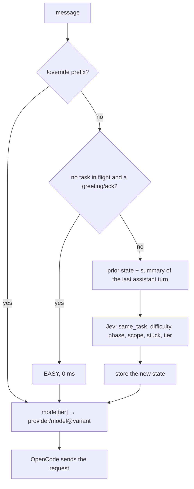

# prompt-demux

An OpenCode plugin that picks how much reasoning effort each message gets.

"thanks" should not cost the same as "design a consensus protocol". Most
messages in a coding session are small: acknowledgements, follow-ups,
one-line edits. A few are genuinely hard. prompt-demux tracks how hard the
*current task* is, turn by turn, sorts each message into EASY / MEDIUM /
HARD in that light, and sets the model and reasoning effort for that one
message accordingly.

[](https://github.com/ajaleelp/prompt-demux/actions)
[](https://nodejs.org)
[](#license)

```
you:  Explain closures in JavaScript
      🔸 MEDIUM → gemini-3.8-flash@high · 340ms

you:  Implement vector-clock based conflict resolution
      🔺 HARD → gemini-3.8-flash@max · 360ms

you:  fix it
      🔺 HARD → gemini-3.8-flash@max · 350ms     (it knows what "it" is)

you:  thanks
      🔹 EASY → gemini-3.8-flash@low · 0ms
```

## What makes it different

**It tracks the task, not just the message.** Every other router classifies
the text of the message on its own. That fails on exactly the messages a
coding session is full of: "fix it", "continue", "ok", "try again". Those
carry the difficulty of whatever you were doing. prompt-demux keeps a small
typed state per session (how hard the task is, what phase it's in, how
stuck you are, which message started it) and has Jev update it every turn.
"fix it" after a typo is EASY; "fix it" as the third failed attempt at a
concurrent merge is HARD, and the state shows `stuck` climbing 1.1 → 1.7 →
2.5 while it happens. This is possible because it runs inside OpenCode as a
plugin; a proxy in front of the API can't see the session.

**Effort first, model second.** The default mode keeps one model and dials
its reasoning effort (`@low` / `@high` / `@max`) per message. The prompt
cache is keyed per model, so staying on one model keeps it warm turn after
turn; only the reasoning tokens change. Switching models per tier is
supported too, it's just not the default.

**Your config, your models.** A mode is three lines of JSON mapping tiers to
`provider/model[@variant]`. Use OpenCode's built-in provider, OpenRouter,
a local Ollama model, free tiers for EASY and premium credits for HARD only.
The defaults are one person's preferences; the file is yours.

**Judged by a decision model, not an LLM.** Each turn is one call to
[TypeSafe Jev](https://typesafe.ai), a model that returns typed answers with
calibrated probabilities instead of text: seven questions, ~100 ms of
inference, no prompt to parse. Jev itself is stateless; the plugin holds the
state and Jev is the transition function. Every definition the dial uses is
plain English in the plugin source. Change it and the dial moves; there is
nothing to retrain.

## Quickstart

You need Node 22+, OpenCode, and a [TypeSafe](https://typesafe.ai) API key.

```bash
export TYPESAFE_API_KEY=...        # put this in your shell profile
git clone https://github.com/ajaleelp/prompt-demux
cd prompt-demux
./scripts/setup.sh                 # npm install + global plugin shim + default config
```

Or from npm:

```bash
opencode plug opencode-effort-demux --global
```

Restart OpenCode fully, pick **Prompt Demux Auto** from the model dropdown,
and messages are dialed from then on. To check from the CLI:

```bash
opencode run -m prompt-demux/auto "thanks" --print-logs | grep dialed
# dialed EASY -> opencode/gemini-3.8-flash@low source=heuristic
```

The default modes use OpenCode's built-in `opencode/` provider. Sign in once
with `/connect` → OpenCode Zen (free) and they work. If the API key is
missing or Jev is unreachable, everything dials MEDIUM with a warning in the
log. Chat never breaks because the classifier is down.

## Configuration

`prompt-demux.json` lives in the project root (or `~/.config/opencode/` as a
global fallback) and is re-read on every message, so there is nothing to
restart while you tune it.

```jsonc
{
  "activeMode": "effort",
  "modes": {
    "effort": {
      "description": "One model, effort dialed per tier",
      "EASY":   "opencode/gemini-3.8-flash@low",
      "MEDIUM": "opencode/gemini-3.8-flash@high",
      "HARD":   "opencode/gemini-3.8-flash@max"
    },
    "balanced": {
      "description": "A different model per tier",
      "EASY":   "opencode/glm-5.3-flash",
      "MEDIUM": "opencode/deepseek-v4-pro",
      "HARD":   "opencode/kimi-k3"
    },
    "free-optimal": {
      "description": "Zero cost on the Zen free tier",
      "EASY":   "opencode/mimo-v2.5-free",
      "MEDIUM": "opencode/muse-spark-1.2-contributor-free",
      "HARD":   "opencode/muse-spark-1.3-contributor-free"
    }
  },
  "classifier": { "timeoutMs": 2000 }
}
```

A model ref is `provider/model`, split on the first slash, so OpenRouter
slugs like `openrouter/anthropic/claude-fable-5.1` work as-is. Add
`@variant` to set reasoning effort; the variant names come from OpenCode's
per-provider defaults (`low`/`high` for Google, `high`/`max` for Anthropic,
`none`…`xhigh` for OpenAI) or from your own `variants` block in
`opencode.json`.

`activeMode` is the default. Each mode also appears in the dropdown as
`prompt-demux/<mode>` if you want to pin one for a session.

### Overrides

Prefix a message to force a decision. The prefix is stripped before the
model sees the text.

| Prefix | Effect |
|---|---|
| `!easy` `!medium` `!hard` | force that tier for this message |
| `!mode:<name>` | switch mode for the rest of the session |

### The `router` tool

The plugin also registers a tool the agent can call, so in chat you can say
"what routing modes are there", "switch the default to balanced", or "add a
mode called reason with o3 for hard".

### Other settings

| Key | Default | |
|---|---|---|
| `classifier.timeoutMs` | 2000 | Jev call budget; on timeout the message dials MEDIUM |
| `classifier.url` | `https://api.typesafe.ai/v1/systemone` | override for a proxy or a stub (also `PROMPT_DEMUX_CLASSIFIER_URL`) |
| `toast` | true | show a per-message toast in the TUI |

The API key is only ever read from `TYPESAFE_API_KEY`.

## How it works



The plugin keeps one small state per session:

```json
{ "difficulty": 3.9, "phase": "debugging", "scope": "system", "stuck": 2.5,
  "task_anchor": "Implement vector-clock based conflict resolution", "turns": 7 }
```

Each turn Jev gets `{ message, prior, last_turn }`, where `last_turn` is a
deterministic summary of the last assistant message built in code (tool
calls, errors, last error, final text). It answers seven questions in one
request:

| Question | Type | What it decides |
|---|---|---|
| `same_task` | yes/no | does the message continue `prior.task_anchor`, or start something new? |
| `difficulty` | score 0–4 | how hard the current task is, as understood so far |
| `phase` | choice | exploring / designing / implementing / debugging / verifying / idle |
| `scope` | choice | one-line / function / module / system |
| `stuck` | score 0–3 | consecutive attempts that didn't resolve |
| `tier` | choice | EASY / MEDIUM / HARD for this message, given all of the above |
| `tier_fresh` | choice | the same, judged with `prior` ignored |

Then code applies two rules. If `same_task` is below 0.4 the task changed:
the state resets, the message becomes the new anchor, and `tier_fresh` is
used instead of `tier`. (Judged next to a HARD prior, a fresh MEDIUM task
reads as EASY by contrast; the prior-blind question fixes that without a
second round-trip.) Otherwise the answers become the new state and `tier`
is used as is. There is no hard-coded floor; the prior state is the floor.

Raw history never accumulates. Jev sees the shape of the task plus one
anchor sentence, so turn 200 costs the same as turn 2, and the log is a
readable trajectory: `difficulty 2.1 → 4.4`, `stuck 0 → 1 → 2`.

Overrides win over everything. The zero-cost greeting regex only runs when
no task is in flight, because "ok" after "Proceed?" carries the task's
effort and only Jev can tell. Results are cached on message + state. Task-
tool subagents pass through the same hook with their own state.

Every decision is logged:

```
dialed HARD -> opencode/gemini-3.8-flash@max source=classifier confidence=0.97 sameTask=0.95 state={difficulty:3.9,phase:debugging,scope:system,stuck:2.5,turns:3} classifierLatencyMs=352
```

## Benchmarks

`npm run bench` in `opencode-plugin/`. September 2026, measured from
Asia-Pacific. Numbers move by ±1 between runs.

| Set | With state | `--no-state` | Median latency |
|---|---|---|---|
| 30 single prompts, 10 per tier | 27–29 / 30 | same (no state to remove) | 360 ms |
| 6 follow-ups with only a `last_turn` | 5 / 6 | same | 360 ms |
| **5 scripted sessions, 23 turns** | **22 / 23** | **18 / 23** | 365 ms |

The ablation is the same model, prompts and questions with `prior` blanked
every turn. It's the honest measure of what the state adds, and it's where
a raw-message window fails: ack chains, retry loops, task switches.

Twenty-three hand-written turns are enough to show the mechanism works;
they are not enough to claim a number. A benchmark built from real
OpenCode transcripts is the next step before the percentages above should
be quoted.

The session set, with the state Jev produced on the way:

```
-- ack chain after a HARD task
✓ Implement vector-clock based conflict re…  HARD 0.99  diff=3.8 stuck=0.0 implementing/system
✓ ok                                          HARD 0.99  diff=3.6
✓ yes                                         HARD 0.97  diff=3.2
✓ go on / continue / continue / and then?     HARD       diff=3.4–3.8
✓ continue (after a failing test)             HARD 0.98  diff=3.9 stuck=1.8 debugging/system

-- retry loop
✓ Implement a distributed transaction coor…  HARD 1.00  stuck=0.0
✓ try again                                   HARD 0.94  stuck=1.1
✓ still failing, fix it                       HARD 0.98  stuck=1.7
✓ fix it                                      HARD 0.97  stuck=2.5

-- task switch mid-HARD
✓ Design a consensus protocol that tolerat…  HARD 1.00
✓ continue                                    HARD 0.94
✓ fix the typo in the README title            EASY 1.00  same_task=0.05 → reset, diff=0.2
✓ thanks, now explain closures in JavaScript  MEDIUM 0.86  same_task=0.04 → reset

-- environmental failure on a MEDIUM task
✓ Add tests for the login module              MEDIUM 0.97
✓ try again (ModuleNotFoundError: pytest)     MEDIUM 0.34  stuck=1.0
✓ ok run them                                 MEDIUM       stuck=0.0

-- EASY chat, then HARD
✗ hi, what does this function do?             MEDIUM 0.54  (want EASY; arguable)
✓ cool                                        EASY 0.94
✓ now design a system that scales this to 1…  HARD 1.00  same_task=0.22 → reset
✓ continue                                    HARD 0.97
```

The single-prompt misses are EASY↔MEDIUM on prompts like "what does this
function do?", where Jev reports low confidence. EASY and HARD come back at
≥0.95; MEDIUM is the soft tier.

Of the ~360 ms, Jev's own inference is 85–127 ms (its
`x-envoy-upstream-service-time` header); the rest is the round trip to
their region. Python `urllib` without keep-alive took ~900 ms for the same
calls; the plugin runs under Bun, which reuses connections.

## Tradeoffs

- **The decision leaves your machine.** Your message and the last few turns
  go to `api.typesafe.ai`. v0.1 ran entirely locally; this doesn't.
- **~360 ms per classified message.** Ten times the old local model. It sits
  in front of a model call that takes seconds, so it's rarely noticeable,
  but it is there. Greetings still cost 0 ms until a task is in flight.
- **State is in memory.** A plugin restart starts from a blank state and
  re-converges within a turn or two.
- **MEDIUM is soft.** Jev is decisive on EASY and HARD and hedges on the
  middle, which matches what an
  [independent benchmark](https://dev.classmethod.jp/en/articles/jev-for-llm-model-routing/)
  found. A bare "try again" with no prior state flips between EASY and
  MEDIUM from run to run; inside a session the state settles it, standalone
  it's a coin toss.
- **A router can't fix a bad session.** Long threads rot, compaction is
  lossy, and the better habit may be a fresh context per phase with the plan
  in a file. Dialing effort well doesn't settle that question, though a
  rising `stuck` score is the first signal you'd want for it.

## Similar work

| Project | What it is | Difference |
|---|---|---|
| [claude-code-router](https://github.com/musistudio/claude-code-router) | Local proxy switching models across providers | A proxy: can't see OpenCode's session or set per-message effort; model switching cold-starts the cache |
| [flaviusapop/jev-router](https://github.com/flaviusapop/jev-router), [prismhq/jev-router](https://github.com/prismhq/jev-router), [blablanumerodeux/model-router](https://github.com/blablanumerodeux/model-router) | Jev-based routers, all proxies | Feed Jev the message text only. One author tried adding metadata and found it lowered confidence. None see prior turns or tool results |
| [opencode-model-router](https://github.com/marco-jardim/opencode-model-router) | OpenCode plugin delegating through subagents | An LLM round-trip per message, no cache stickiness |
| [opencode-reasoning-effort](https://github.com/Aliancn/opencode-reasoning-effort) | Patches `fetch` so `reasoning_effort` reaches the wire | Single purpose, no tiering |
| OpenRouter `auto` | Server-side model routing | Opaque, not local, no effort dial, no multi-wallet split |

Text-only classifiers, Jev included, top out around 76% in published
comparisons. The gain here comes from what Jev is shown, not from Jev
itself; the `--no-state` ablation above is the measurement.

## How we got here

v0.1 shipped a local ModernBERT classifier: ONNX, CPU only, ~31 ms, 750 MB
download, a Python service on port 8010. It worked and we paused the project
anyway, for two reasons.

The first was that it classified the message text alone. "fix it" after
200k tokens of debugging a race condition went to the cheapest tier every
time, and no amount of training changes that: a single-string encoder can't
see context it isn't given.

The second was the lighter-model trap. On our 30-prompt set the fp32 model
scored 66.7%. The int8 export we hoped to ship in-process scored 43.3%,
worse than no model at all; it collapsed the MEDIUM class and sent seven
HARD prompts to EASY. Every tweak to the tier definitions meant retraining.

Jev takes structured state as input, so the context problem became a
matter of passing the right fields. v0.2 sent the last three raw turns and
the last tool result: same 30 prompts, 93–97%. It deleted the Python
service and the model (old code at
[`543f197`](https://github.com/ajaleelp/prompt-demux/tree/543f197/classifier-service)).

A three-turn window still fails on ack chains ("ok", "yes", "continue" ×8
after a HARD task leaves nothing about the task in view), and sending more
raw history is the wrong fix: irrelevant state degrades judgment and
latency scales with input. v0.3 replaced the window with the typed state
described above, and gated the greeting regex, which had been dialing
"continue" EASY at 0 ms mid-task.

## Development

```
opencode-plugin/
├── src/lib.ts        parsing, config, heuristics, summarizeLastTurn(), applyAnswers(), jevUpdate(), the questions
├── src/main.ts       chat.message hook + router tool
└── tests/
    ├── lib.test.ts   24 unit tests (node:test, no network)
    ├── smoke.mjs     end-to-end against live Jev
    └── jev-bench.mjs accuracy benchmark (--no-state for the ablation)
scripts/setup.sh      npm install + global shim
scripts/install-global.sh
.opencode/plugins/prompt-demux.ts   shim OpenCode auto-loads in this repo
prompt-demux.json
```

```bash
cd opencode-plugin
npm install
npx tsc --noEmit
node --test tests/lib.test.ts
node tests/smoke.mjs        # needs TYPESAFE_API_KEY (or ../.env)
node tests/jev-bench.mjs
```

Notes for anyone hacking on it:

- OpenCode 1.18.x has no `chat.model` hook despite what some examples show.
  Dialing works by mutating `UserMessage.model` (and `variant`) in
  `chat.message`; verified end-to-end against stored sessions.
- The virtual `prompt-demux/*` provider is injected in the `config` hook so
  it shows up in the dropdown. `small_model` is redirected away from it so
  title generation and compaction never hit the virtual provider.
- Fallback chain: override → heuristic (no task in flight) → cached Jev →
  Jev → MEDIUM.
- `docs/plans/` has the design and plan for the state estimator.

## Troubleshooting

- **Plugin doesn't load.** The shim must be under `.opencode/plugins/`
  (plural). Run with `--print-logs`; plugin errors print at startup.
- **Everything dials MEDIUM.** The log line says why: either
  `TYPESAFE_API_KEY` isn't visible to the process that launched OpenCode, or
  Jev timed out. Export the key in that shell, or raise
  `classifier.timeoutMs`.

## Roadmap

- [ ] Act on `stuck`: a "consider `/compact <focus>` or a fresh session"
      toast once real logs show it's reliable
- [ ] Persist session state across plugin restarts
- [ ] A benchmark built from real OpenCode session transcripts
- [ ] Confidence threshold for the soft MEDIUM tier

## License

MIT
