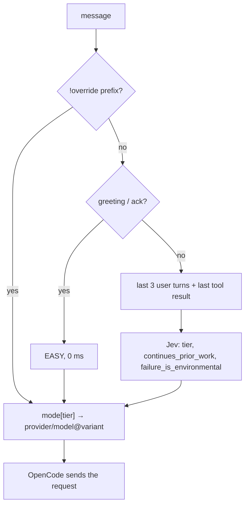

# prompt-demux

An OpenCode plugin that picks how much reasoning effort each message gets.

"thanks" should not cost the same as "design a consensus protocol". Most
messages in a coding session are small: acknowledgements, follow-ups,
one-line edits. A few are genuinely hard. prompt-demux reads each message
*and the last few turns of the session*, sorts it into EASY / MEDIUM / HARD,
and sets the model and reasoning effort for that one message accordingly.

[](https://github.com/ajaleelp/prompt-demux/actions)
[](https://nodejs.org)
[](#license)

```
you:  Explain closures in JavaScript
      🔸 MEDIUM → gemini-3.8-flash@high · 340ms

you:  Implement vector-clock based conflict resolution
      🔺 HARD → gemini-3.8-flash@max · 360ms

you:  fix it
      🔺 HARD → gemini-3.8-flash@max · 350ms     (it knows what "it" is)

you:  thanks
      🔹 EASY → gemini-3.8-flash@low · 0ms
```

## What makes it different

**It sees the session, not just the message.** Every other router classifies
the text of the message on its own. That fails on exactly the messages a
coding session is full of: "fix it", "continue", "try again", "why". Those
inherit the difficulty of whatever you were doing. prompt-demux sends the
message together with the last three user turns and the last tool result or
assistant reply, so "fix it" after a typo is EASY and "fix it" after a
failing concurrent-merge test is HARD. This is possible because it runs
inside OpenCode as a plugin; a proxy in front of the API can't see any of
that.

**Effort first, model second.** The default mode keeps one model and dials
its reasoning effort (`@low` / `@high` / `@max`) per message. The prompt
cache is keyed per model, so staying on one model keeps it warm turn after
turn; only the reasoning tokens change. Switching models per tier is
supported too, it's just not the default.

**Your config, your models.** A mode is three lines of JSON mapping tiers to
`provider/model[@variant]`. Use OpenCode's built-in provider, OpenRouter,
a local Ollama model, free tiers for EASY and premium credits for HARD only.
The defaults are one person's preferences; the file is yours.

**Judged by a decision model, not an LLM.** Classification is one call to
[TypeSafe Jev](https://typesafe.ai), a model that returns typed answers with
calibrated probabilities instead of text. Around 100 ms of inference, no
prompt to parse, and the tier definitions are three sentences of plain
English in the plugin source. Change them and the dial moves; there is
nothing to retrain.

## Quickstart

You need Node 22+, OpenCode, and a [TypeSafe](https://typesafe.ai) API key.

```bash
export TYPESAFE_API_KEY=...        # put this in your shell profile
git clone https://github.com/ajaleelp/prompt-demux
cd prompt-demux
./scripts/setup.sh                 # npm install + global plugin shim + default config
```

Or from npm:

```bash
opencode plug opencode-effort-demux --global
```

Restart OpenCode fully, pick **Prompt Demux Auto** from the model dropdown,
and messages are dialed from then on. To check from the CLI:

```bash
opencode run -m prompt-demux/auto "thanks" --print-logs | grep dialed
# dialed EASY -> opencode/gemini-3.8-flash@low source=heuristic
```

The default modes use OpenCode's built-in `opencode/` provider. Sign in once
with `/connect` → OpenCode Zen (free) and they work. If the API key is
missing or Jev is unreachable, everything dials MEDIUM with a warning in the
log. Chat never breaks because the classifier is down.

## Configuration

`prompt-demux.json` lives in the project root (or `~/.config/opencode/` as a
global fallback) and is re-read on every message, so there is nothing to
restart while you tune it.

```jsonc
{
  "activeMode": "effort",
  "modes": {
    "effort": {
      "description": "One model, effort dialed per tier",
      "EASY":   "opencode/gemini-3.8-flash@low",
      "MEDIUM": "opencode/gemini-3.8-flash@high",
      "HARD":   "opencode/gemini-3.8-flash@max"
    },
    "balanced": {
      "description": "A different model per tier",
      "EASY":   "opencode/glm-5.3-flash",
      "MEDIUM": "opencode/deepseek-v4-pro",
      "HARD":   "opencode/kimi-k3"
    },
    "free-optimal": {
      "description": "Zero cost on the Zen free tier",
      "EASY":   "opencode/mimo-v2.5-free",
      "MEDIUM": "opencode/muse-spark-1.2-contributor-free",
      "HARD":   "opencode/muse-spark-1.3-contributor-free"
    }
  },
  "classifier": { "timeoutMs": 2000 }
}
```

A model ref is `provider/model`, split on the first slash, so OpenRouter
slugs like `openrouter/anthropic/claude-fable-5.1` work as-is. Add
`@variant` to set reasoning effort; the variant names come from OpenCode's
per-provider defaults (`low`/`high` for Google, `high`/`max` for Anthropic,
`none`…`xhigh` for OpenAI) or from your own `variants` block in
`opencode.json`.

`activeMode` is the default. Each mode also appears in the dropdown as
`prompt-demux/<mode>` if you want to pin one for a session.

### Overrides

Prefix a message to force a decision. The prefix is stripped before the
model sees the text.

| Prefix | Effect |
|---|---|
| `!easy` `!medium` `!hard` | force that tier for this message |
| `!mode:<name>` | switch mode for the rest of the session |

### The `router` tool

The plugin also registers a tool the agent can call, so in chat you can say
"what routing modes are there", "switch the default to balanced", or "add a
mode called reason with o3 for hard".

### Other settings

| Key | Default | |
|---|---|---|
| `classifier.timeoutMs` | 2000 | Jev call budget; on timeout the message dials MEDIUM |
| `classifier.url` | `https://api.typesafe.ai/v1/systemone` | override for a proxy or a stub (also `PROMPT_DEMUX_CLASSIFIER_URL`) |
| `toast` | true | show a per-message toast in the TUI |

The API key is only ever read from `TYPESAFE_API_KEY`.

## How it works



1. Overrides win. Then a zero-cost regex catches greetings and
   acknowledgements.
2. For anything else the plugin fetches the session's recent messages via
   the OpenCode SDK and builds a small state object: the message, the last
   three user turns (300 chars each), and the last assistant outcome, which
   is the most recent tool error if there was one, otherwise the assistant's
   last text.
3. One request to Jev asks three questions over that state. `tier` is a
   choice between EASY / MEDIUM / HARD. `continues_prior_work` and
   `failure_is_environmental` are yes/no probabilities; they are logged
   today and not yet acted on.
4. The tier is looked up in the active mode and the result is written onto
   the message's `model` (and `variant`) before OpenCode sends it.

Results are cached on message + context, so the same follow-up after the
same work costs nothing. Task-tool subagents pass through the same hook and
are dialed on their own subtask.

Every decision is logged:

```
dialed HARD -> opencode/gemini-3.8-flash@max source=classifier confidence=1.00 continuesPriorWork=0.95 failureIsEnvironmental=0.25 classifierLatencyMs=352
```

## Benchmarks

`npm run bench` in `opencode-plugin/`. September 2026, measured from
Asia-Pacific.

| Set | Result | Median latency |
|---|---|---|
| 30 single prompts, 10 per tier | 28–29 / 30 | 365 ms |
| 6 context-dependent follow-ups | 6 / 6 | 368 ms |

The one or two misses on the first set are EASY↔MEDIUM on prompts like
"what does this function do?", and Jev reports low confidence (≤0.6) on
them. EASY and HARD come back at ≥0.95.

The second set is the same short message with different session state:

| Message | After | Tier | Signals |
|---|---|---|---|
| fix it | a README typo fix | EASY 0.95 | continues 0.66 |
| fix it | 4 failing tests, race in `merge()` | HARD 1.00 | continues 0.95 |
| continue | a variable rename | EASY 0.73 | continues 0.93 |
| continue | section 1 of 4 of a consensus design | HARD 1.00 | continues 0.97 |
| try again | `ModuleNotFoundError: pytest` | MEDIUM 0.65 | env_fail 0.94 |
| why | proposing an outbox pattern for a monolith split | HARD 0.83 | continues 0.89 |

Of the ~365 ms, Jev's own inference is 85–127 ms (its
`x-envoy-upstream-service-time` header); the rest is the round trip to
their region. From Python `urllib` without keep-alive the same calls took
~900 ms; the plugin runs under Bun, which reuses connections.

## Tradeoffs

- **The decision leaves your machine.** Your message and the last few turns
  go to `api.typesafe.ai`. v0.1 ran entirely locally; this doesn't.
- **~350 ms per classified message.** Ten times the old local model. It sits
  in front of a model call that takes seconds, so it's rarely noticeable,
  but it is there.
- **MEDIUM is soft.** Jev is decisive on EASY and HARD and hedges on the
  middle, which matches what an
  [independent benchmark](https://dev.classmethod.jp/en/articles/jev-for-llm-model-routing/)
  found. Expect some drift on "explain this briefly"-shaped prompts.
- **A router can't fix a bad session.** Long threads rot, compaction is
  lossy, and the better habit may be a fresh context per phase with the plan
  in a file. Dialing effort well doesn't settle that question.

## Similar work

| Project | What it is | Difference |
|---|---|---|
| [claude-code-router](https://github.com/musistudio/claude-code-router) | Local proxy switching models across providers | A proxy: can't see OpenCode's session or set per-message effort; model switching cold-starts the cache |
| [flaviusapop/jev-router](https://github.com/flaviusapop/jev-router), [prismhq/jev-router](https://github.com/prismhq/jev-router), [blablanumerodeux/model-router](https://github.com/blablanumerodeux/model-router) | Jev-based routers, all proxies | Feed Jev the message text only. One author tried adding metadata and found it lowered confidence. None see prior turns or tool results |
| [opencode-model-router](https://github.com/marco-jardim/opencode-model-router) | OpenCode plugin delegating through subagents | An LLM round-trip per message, no cache stickiness |
| [opencode-reasoning-effort](https://github.com/Aliancn/opencode-reasoning-effort) | Patches `fetch` so `reasoning_effort` reaches the wire | Single purpose, no tiering |
| OpenRouter `auto` | Server-side model routing | Opaque, not local, no effort dial, no multi-wallet split |

Text-only classifiers, Jev included, top out around 76% in published
comparisons. The gain here comes from what Jev is shown, not from Jev
itself.

## How we got here

v0.1 shipped a local ModernBERT classifier: ONNX, CPU only, ~31 ms, 750 MB
download, a Python service on port 8010. It worked and we paused the project
anyway, for two reasons.

The first was that it classified the message text alone. "fix it" after
200k tokens of debugging a race condition went to the cheapest tier every
time, and no amount of training changes that: a single-string encoder can't
see context it isn't given.

The second was the lighter-model trap. On our 30-prompt set the fp32 model
scored 66.7%. The int8 export we hoped to ship in-process scored 43.3%,
worse than no model at all; it collapsed the MEDIUM class and sent seven
HARD prompts to EASY. Every tweak to the tier definitions meant retraining.

Jev takes structured state as input, so the context problem became a
matter of passing the right fields. Same 30 prompts: 93–97%. The six
context-dependent cases above: all correct. So v0.2 deleted the Python
service and the model. The old code is in git history at
[`543f197`](https://github.com/ajaleelp/prompt-demux/tree/543f197/classifier-service).

## Development

```
opencode-plugin/
├── src/lib.ts        parsing, config, heuristics, buildSessionState(), jevClassify(), tier prose
├── src/main.ts       chat.message hook + router tool
└── tests/
    ├── lib.test.ts   23 unit tests (node:test, no network)
    ├── smoke.mjs     end-to-end against live Jev
    └── jev-bench.mjs accuracy benchmark
scripts/setup.sh      npm install + global shim
scripts/install-global.sh
.opencode/plugins/prompt-demux.ts   shim OpenCode auto-loads in this repo
prompt-demux.json
```

```bash
cd opencode-plugin
npm install
npx tsc --noEmit
node --test tests/lib.test.ts
node tests/smoke.mjs        # needs TYPESAFE_API_KEY (or ../.env)
node tests/jev-bench.mjs
```

Notes for anyone hacking on it:

- OpenCode 1.18.x has no `chat.model` hook despite what some examples show.
  Dialing works by mutating `UserMessage.model` (and `variant`) in
  `chat.message`; verified end-to-end against stored sessions.
- The virtual `prompt-demux/*` provider is injected in the `config` hook so
  it shows up in the dropdown. `small_model` is redirected away from it so
  title generation and compaction never hit the virtual provider.
- Fallback chain: override → heuristic → cached Jev → Jev → MEDIUM.

## Troubleshooting

- **Plugin doesn't load.** The shim must be under `.opencode/plugins/`
  (plural). Run with `--print-logs`; plugin errors print at startup.
- **Everything dials MEDIUM.** The log line says why: either
  `TYPESAFE_API_KEY` isn't visible to the process that launched OpenCode, or
  Jev timed out. Export the key in that shell, or raise
  `classifier.timeoutMs`.

## Roadmap

- [ ] Act on the signals: inherit the previous tier when
      `continues_prior_work` is high; don't inflate on
      `failure_is_environmental`
- [ ] A larger context-dependent benchmark built from real OpenCode session
      transcripts
- [ ] Confidence threshold for the soft MEDIUM tier

## License

MIT
